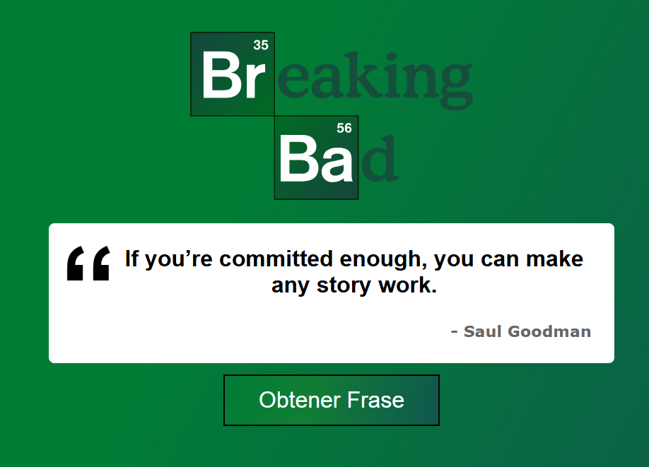

## Acerca del Proyecto

Este es un **cliente web** desarrollado en React que interactúa con una API externa para mostrar frases aleatorias de la popular serie Breaking Bad. La aplicación carga una frase por defecto al iniciar y permite al usuario obtener una nueva frase con cada clic en un botón.


-----

## 🚀 Tecnologías

  * **React**: Librería de JavaScript para construir interfaces de usuario interactivas.
  * **TypeScript**: Un superconjunto tipado de JavaScript que mejora la calidad y mantenibilidad del código.
  * **Tailwind CSS**: Un framework CSS de bajo nivel que facilita el diseño rápido y responsivo.
  * **Vite**: Una herramienta de construcción rápida para proyectos web modernos, utilizada para el entorno de desarrollo.
  * **NPM**: Gestor de paquetes de Node.js, utilizado para la gestión de dependencias del proyecto.

-----

## ⚙️ Instalación y Uso

Sigue estos pasos para ejecutar el proyecto en tu máquina local.

### Prerrequisitos

Asegúrate de tener instalado:

  * **Node.js** (versión 14 o superior recomendada)
  * **NPM** (viene incluido con Node.js)

### Pasos

1.  **Clona el repositorio** de GitHub:
    ```bash
    git clone https://github.com/kevincisnero01/citas-breakingbad-client-react.git
    ```
2.  **Navega** al directorio del proyecto:
    ```bash
    cd citas-breakingbad-client-react
    ```
3.  **Instala las dependencias** del proyecto:
    ```bash
    npm install
    ```
4.  **Inicia el servidor de desarrollo**:
    ```bash
    npm run dev
    ```
    La aplicación se abrirá automáticamente en tu navegador predeterminado, usualmente en `http://localhost:5173/` (o un puerto similar).

-----

## 🎯 Funcionalidades Clave

  * **Consulta API**: Realiza peticiones a una API externa para obtener frases de Breaking Bad.
  * **Carga por defecto**: Muestra una frase automáticamente al cargar la aplicación.
  * **Refresco Dinámico**: Actualiza la frase mostrada cada vez que el usuario presiona el botón.

-----

## 🔗 API Consumida

Este proyecto consume frases de la siguiente API:

  * **URL Base**: `https://api.breakingbadquotes.xyz`

